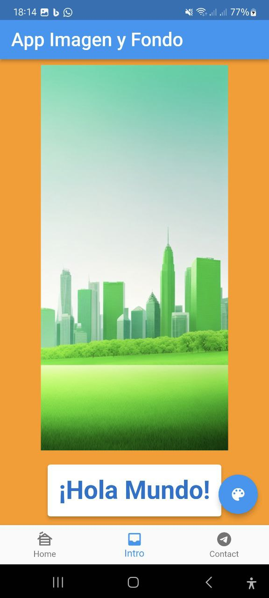

# Mi Proyecto Flutter

Este es un proyecto de Flutter que muestra imágenes y cambia el color de fondo. Puedes encontrar más detalles sobre cómo funciona en la descripción a continuación.

## Descripción

Este proyecto tiene las siguientes características:

- Muestra imágenes desde URLs externas.
- Cambia el color de fondo al presionar un botón.
- Incluye una barra de navegación inferior con tres opciones.

## Capturas de Pantalla

 Captura 1
 Captura 2
 Captura 3
 Captura_4

## Instalación

1. Clona este repositorio: `git clone https://github.com/tu-usuario/mi-proyecto-flutter.git`
2. Abre el proyecto en Visual Studio Code o Android Studio.
3. Ejecuta `flutter pub get` para instalar las dependencias.
4. Ejecuta la aplicación en un emulador o dispositivo físico.

## Contribución

Si deseas contribuir a este proyecto, sigue estos pasos:

1. Crea un fork del repositorio.
2. Crea una nueva rama para tus cambios: `git checkout -b mi-nueva-funcionalidad`
3. Realiza tus cambios y crea un commit: `git commit -m "Agrega nueva funcionalidad"`
4. Envía tus cambios al repositorio remoto: `git push origin mi-nueva-funcionalidad`
5. Abre una solicitud de extracción en GitHub.

## Licencia

Este proyecto está bajo la Licencia MIT. Consulta el archivo LICENSE para más detalles.
